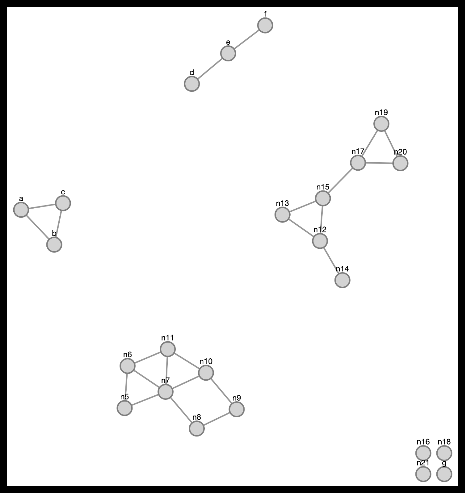
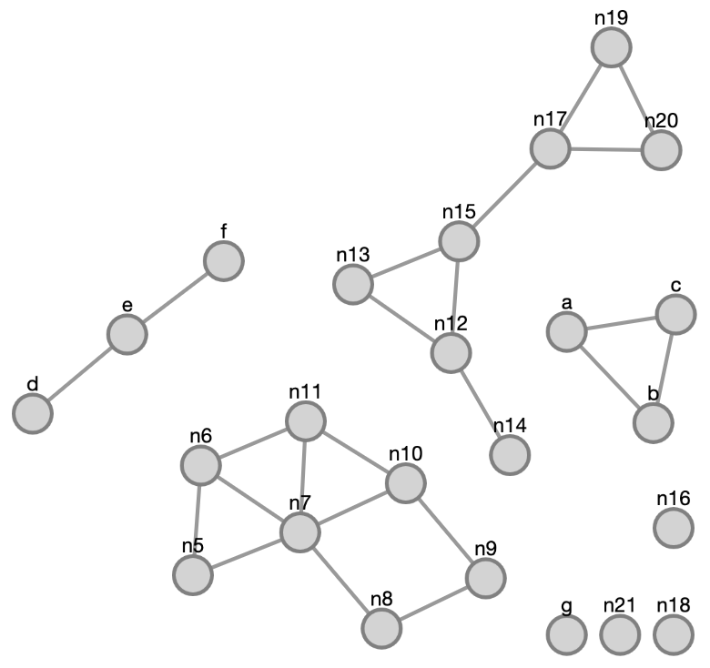

cytoscape-layout-utilities
================================================================================

## Description

This Cytoscape.js extension provides miscellenaous layout utilities in order to manage the placement of nodes or components without layout information. 

Sometimes, your graph will have a pre-calculated layout but changes (addition and/or deletion of nodes and edges or simply changes in graph geometry) will require an *incremental* layout to adjust the existing layout according to these changes. However, often times, the new nodes do not have an initial position (or a good one) for incremental layout (randomize: false) to produce good results. Some utility methods in this library try to choose the best position for any node without a previous or outdated layout, so that subsequent incremental layout is a good one. 

When doing so, these methods use the following heuristics [1]:

- If a new node without layout has a *single* neighbor with layout information,  the idea is to split the neighboring space around the single neighbor into quadrants and scoring how crowded each quadrant is, and placing the new node in the least crowded quadrant.

- If a new node without layout has *multiple* neighbors with layout information, we chose the position of the new node without layout to be the geometric center of all its neighbors.

- If a new node without layout has *no* neighbors with layout information, then we place it around the periphery of the bounding box of all nodes with up-to-date layout.

In all of the above cases, we try to choose a position which is an *ideal edge length* away from a neighbor, and use a random *offset* for the final location of the node to avoid multiple nodes ending up at the exact same location since most layout algorithms will not gracefully handle such cases. Hence these are exposed as user customizable options by the extension.

Another utility available in this library is for placing / packing components of a disconnected graph. Often times a particular layout algorithm will nicely lay out individual components of a disconnected graph but will not properly pack these components with respect to each other. Below is an example where [a layout algorithm]() works by laying out a disconnected graph normally (left) and uses this extension to pack components after layout (right).
<p align="center">
  
  &emsp;&emsp;&emsp;&emsp;&emsp;&emsp;&emsp;
  
</p>

This library uses a polyomino packing based algorithm to achieve this. A polyomino is a geometric figure composed of unit squares joined at their edges. Each component is represented with a polyomino and these polyominoes are packed by a greedy algorithm described in [2].

<p align="center">
  
</p>

One can provide the list of nodes and edges in each component of a disconnected graph and this library will calculate a good respective positioning for these components, returning the *amount by which each graph object in a component needs to be relocated*. The utility will take a *desired aspect ratio* and try to pack components so that all components will fit into a window of this aspect ratio, minimizing wasted space. It will also take *polyomino grid size factor* as an option, which is 1.0 by default, corresponding to the average node dimension in the graph. The lower this factor is the finer of a grid will be used. Similarly, higher values will correspond to relatively coarser grid. Notice that use of a finer grid will result in better packing of components at the cost of additional running time.

Here is a [demo](https://raw.githack.com/iVis-at-Bilkent/cytoscape.js-layout-utilities/unstable/demo.html).

Please cite the following when you use this extension:

[1] U. Dogrusoz, A. Karacelik, I. Safarli, H. Balci, L. Dervishi, M.C. Siper, "[Efficient methods and readily customizable libraries for managing complexity of large networks](http://journals.plos.org/plosone/article?id=10.1371/journal.pone.0197238)", PLOS ONE, 13(5):e0197238, 2018.

[2] K. Freivalds, U. Dogrusoz, and P. Kikusts, "[Disconnected Graph Layout and the Polyomino Packing Approach](http://www.springeronline.com/sgw/cda/frontpage/0,10735,5-40109-22-2208018-0,00.html)", LNCS, vol. 2265, pp. 378-391, 2002.

## Dependencies

 * Cytoscape.js ^3.7.0

## Usage instructions

Download the library:
 * via npm: `npm install cytoscape-layout-utilities`,
 * via bower: `bower install cytoscape-layout-utilities`, or
 * via direct download in the repository (probably from a tag).

Import the library as appropriate for your project:

ES import:

```js
import cytoscape from 'cytoscape';
import layoutUtilities from 'cytoscape-layout-utilities';

cytoscape.use( layoutUtilities );
```

CommonJS require:

```js
let cytoscape = require('cytoscape');
let layoutUtilities = require('cytoscape-layout-utilities');

cytoscape.use( layoutUtilities ); // register extension
```

AMD:

```js
require(['cytoscape', 'cytoscape-layout-utilities'], function( cytoscape, layoutUtilities ){
  layoutUtilities( cytoscape ); // register extension
});
```

Plain HTML/JS has the extension registered for you automatically, because no `require()` is needed.


## API

```var instance = cy.layoutUtilities(options)```

Initializes the extension and sets options. This can be used to override default options. 

An instance has a number of functions available:

```instance.placeHiddenNodes(nodesWithLayout)```

Places hidden neighbors of each given node. It is assumed that the given nodes have pre-calculated layout, and with this method, proper initial positions are calculated for their hidden neighbors to prepare them for a successful incremental layout.

```instance.placeNewNodes(nodesWithoutLayout)```

Places each given node. It is assumed that the remaining nodes in the graph already have pre-calculated layout, whereas given nodes do not. With this method, given nodes are positioned with respect to their already laid out neighbors so that a following incremental layout produce a good layout for the entire graph. 

## Default Options

```
      // Placing new / hidden nodes
      idealEdgeLength: 50,
      offset: 20,
      
      // Packing
      desiredAspectRatio: 1,
      polyominoGridSizeFactor: 1,
      utilityFunction: 1  // Maximize adjusted Fullness   2: maximizes weighted function of fullness and aspect ratio

```


## Build targets

* `npm run test` : Run Mocha tests in `./test`
* `npm run build` : Build `./src/**` into `cytoscape-layout-utilities.js`
* `npm run watch` : Automatically build on changes with live reloading (N.b. you must already have an HTTP server running)
* `npm run dev` : Automatically build on changes with live reloading with webpack dev server
* `npm run lint` : Run eslint on the source

N.b. all builds use babel, so modern ES features can be used in the `src`.


## Publishing instructions

This project is set up to automatically be published to npm and bower.  To publish:

1. Build the extension : `npm run build:release`
1. Commit the build : `git commit -am "Build for release"`
1. Bump the version number and tag: `npm version major|minor|patch`
1. Push to origin: `git push && git push --tags`
1. Publish to npm: `npm publish .`
1. If publishing to bower for the first time, you'll need to run `bower register cytoscape-layout-utilities https://github.com//cytoscape.js-layout-utilities.git`
1. [Make a new release](https://github.com//cytoscape.js-layout-utilities/releases/new) for Zenodo.

## Team
  * [Nasim Saleh](https://github.com/nasimsaleh), [Rumeysa Özaydın](https://github.com/rumeysaozaydin) and [Ugur Dogrusoz](https://github.com/ugurdogrusoz) of [i-Vis at Bilkent University](http://www.cs.bilkent.edu.tr/~ivis)
